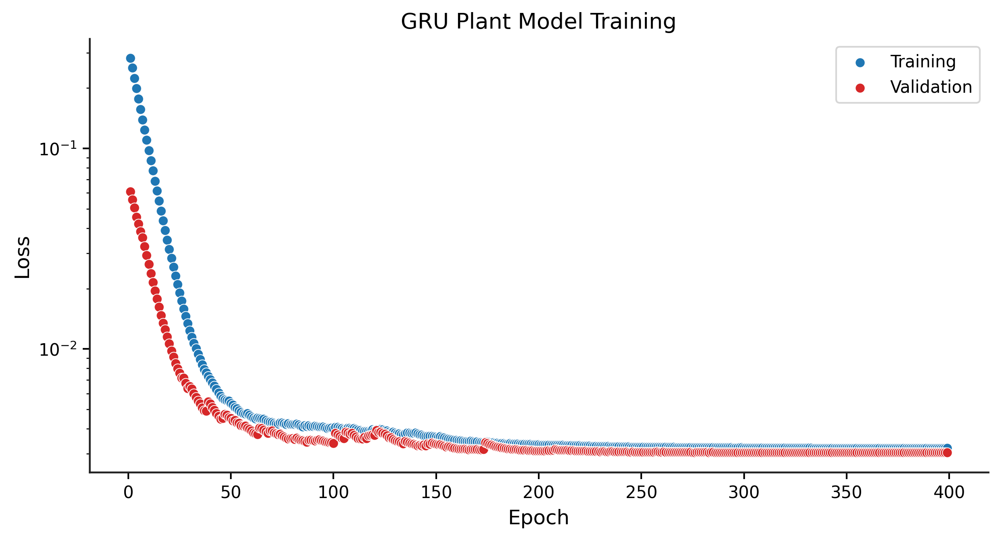
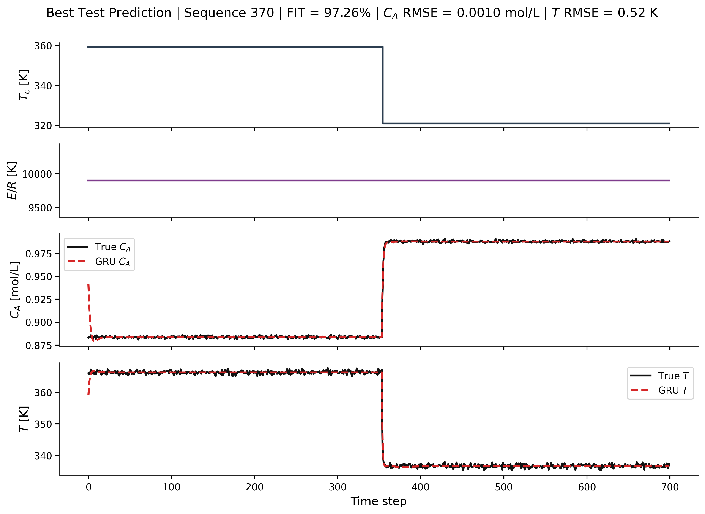

# Model Training

## Objective
Train a GRU model using open-loop data.

## Inputs
- Training sequences 
- Validation sequences 
- Normalization statistics 

## Outputs
- Trained model 
- Loss curves
- FIT metrics

## Representative Results

### Training Loss

### Model Prediction

