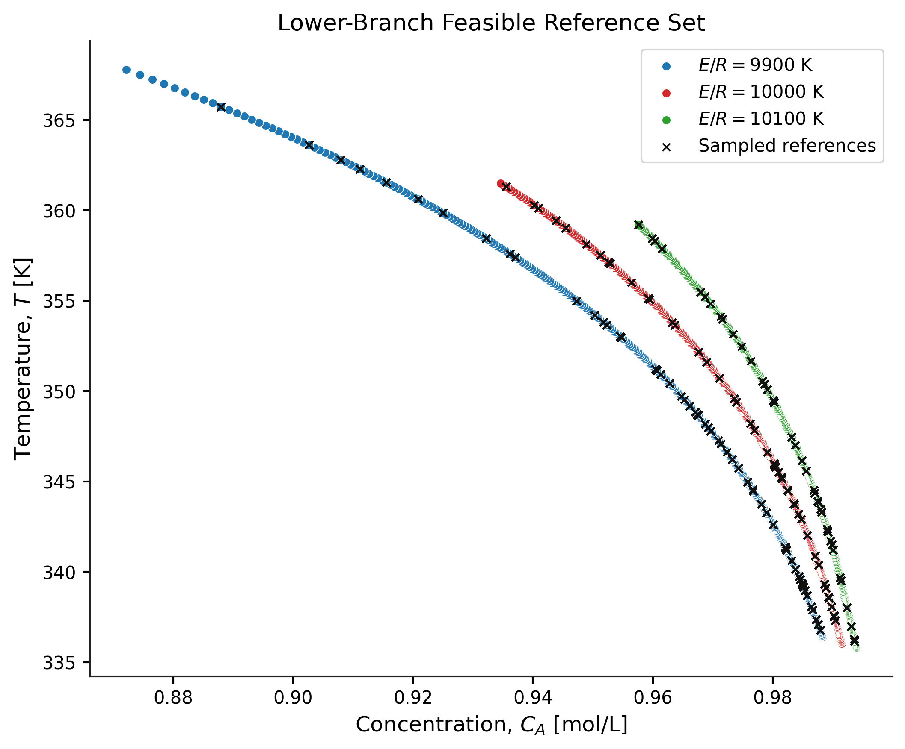
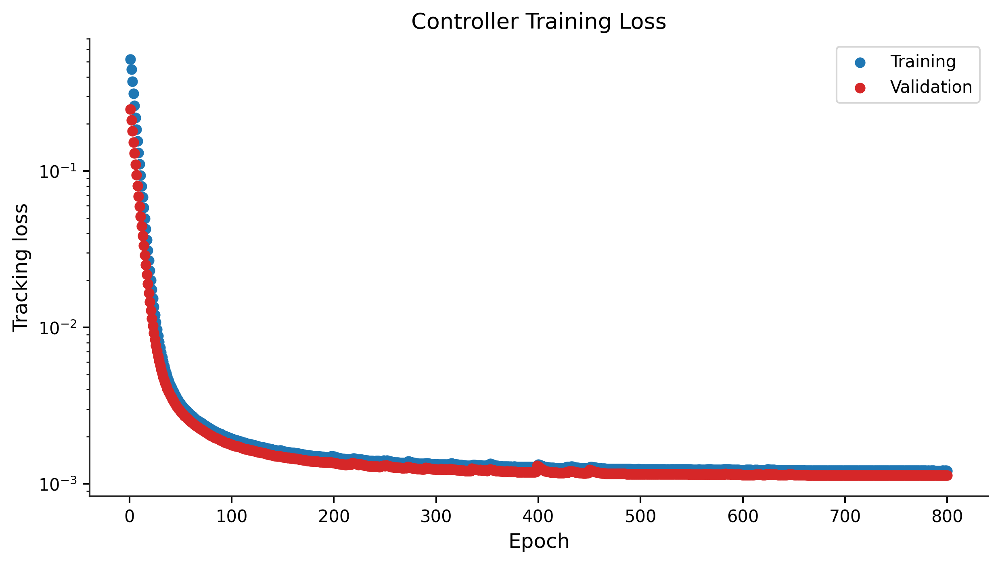
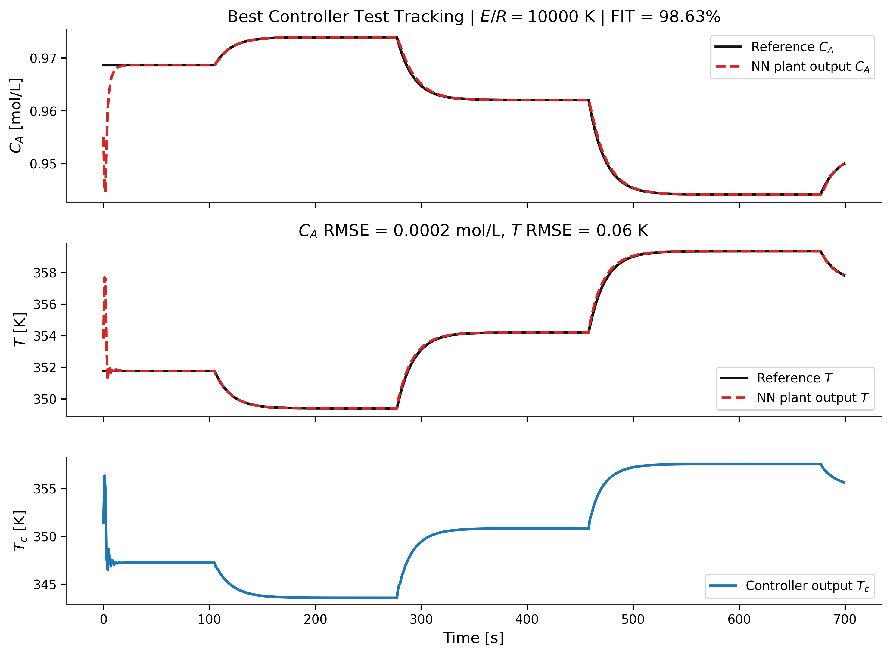

# Controller Training

## Objective

The objective of this component is to train a GRU-based controller capable of tracking desired reference trajectories.

## Inputs

* Open-loop training and validation datasets
* Normalization statistics
* Trained GRU model 

## Outputs

* A trained Controller GRU network 
* Feasible data generation trajectories used for controller training
* Training loss evolution plots
* FIT index metrics across test sequences
* Representative controller tracking performance plots

## Representative Results

### Feasible Reference Trajectories

### Training Performance

### Controller Tracking Performance

