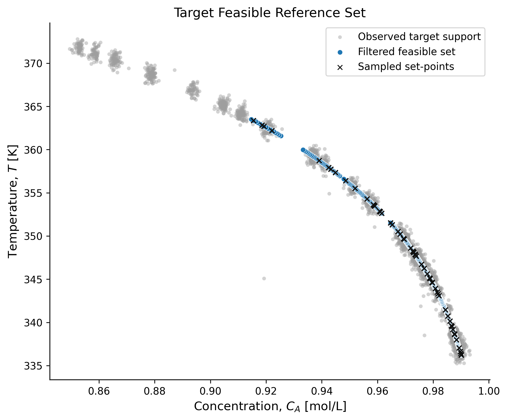

# Fine-Tuning

## Objective

The objective of this component is to adapt the pre-trained source model and controller to a target plant using transfer learning techniques.

## Inputs

* Pre-trained Model GRU network 
* Pre-trained Controller GRU network
* Normalization statistics

## Outputs

* Fine-tuned Model GRU network
* Fine-tuned Controller GRU network 
* Fine-tuning loss evolution plots
* Representative tracking performance plot
* Feasible data generation trajectories

## Representative Results

### Fine-Tuning Data Generation

### Model Fine-Tuning Performance

### Controller Fine-Tuning Performance

### Target Plant Tracking

