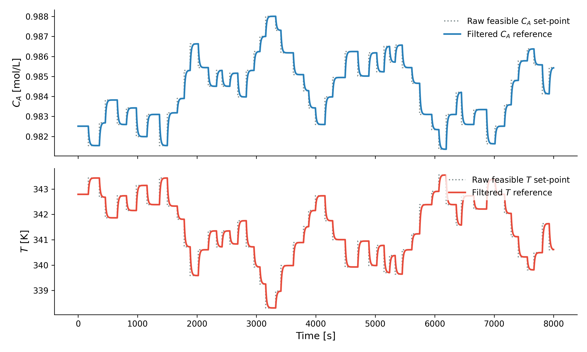
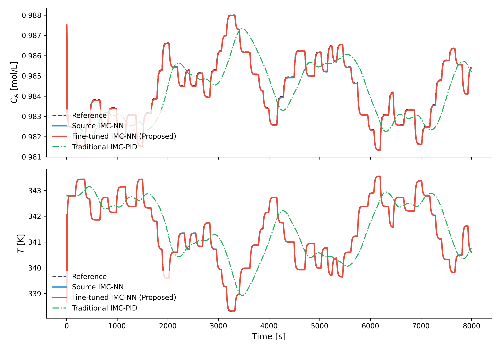
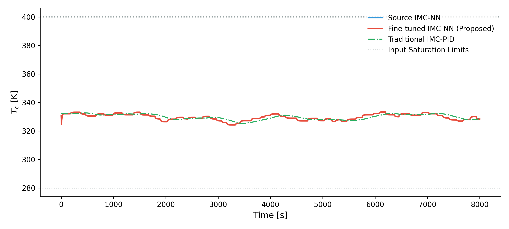
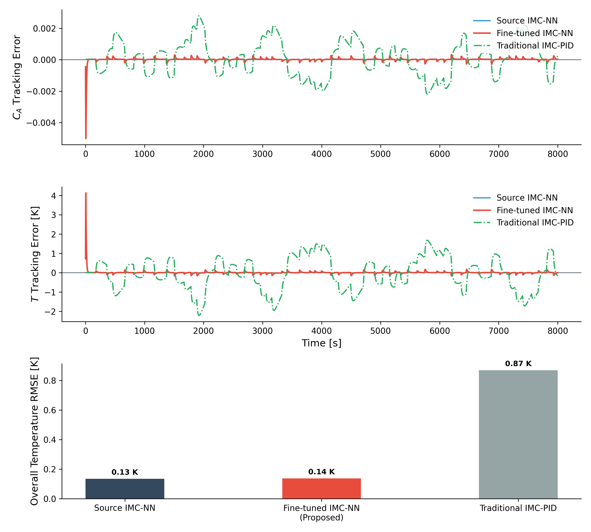

# Closed-Loop Simulation

## Objective

The objective of this component is to evaluate and compare the closed-loop performance of different control strategies.

## Compared Controllers

The following control strategies are evaluated:

1. Traditional IMC-PID
2. Source NN-IMC (without fine-tuning)
3. Fine-Tuned NN-IMC

## Inputs

* Openloop datasets
* Trained GRU model  
* Trained GRU controller
* Fine-tuned GRU model 
* Fine-tuned GRU controller
* Normalization statistics

## Outputs

* Closed-loop performance summary
* Output tracking comparison plots
* Control action comparison plots
* RMSE comparison plots
* Reference trajectory plots

## Representative Results

### Reference Trajectories

### Output Tracking Comparison

### Control Action Comparison

### RMSE Comparison

